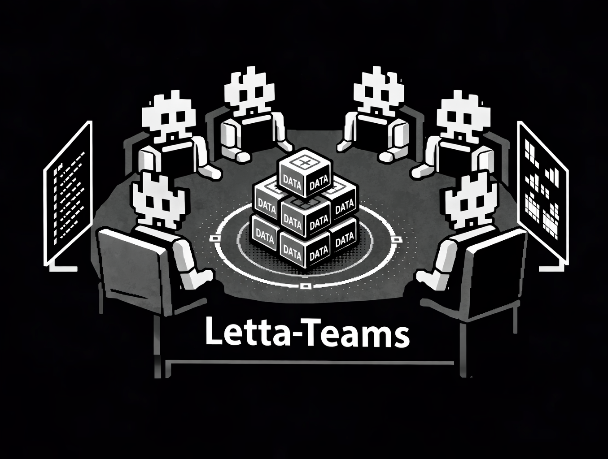
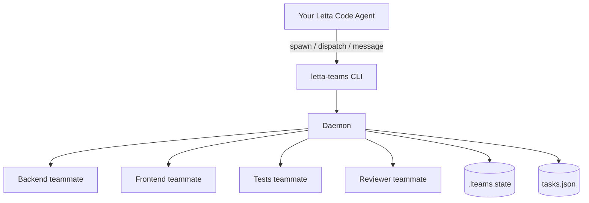
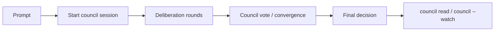

# Letta Teams

**Give your agents a team to work with instead of having them do everything alone.**

[](https://www.npmjs.com/package/letta-teams) [](https://buymeacoffee.com/vedant0200) [](https://github.com/vedant020000/letta-teams/issues)


A CLI interface for Letta Code and LettaBot agents to orchestrate teams of stateful AI agents. Spawn specialized teammates, dispatch parallel tasks, and coordinate work across multiple agents with persistent memory.



## Overview

Letta Teams helps agents collaborate like a real team, not a single overloaded worker.

Core features:
- **Teams**: spawn specialized teammates and split work in parallel
- **Statefulness**: each teammate keeps identity and context across tasks
- **Memory**: persistent memory + init flows for better long-running coordination
- **Council**: run structured multi-agent deliberation and get one final decision

## Installation

Install the CLI:

```bash
npm install -g letta-teams
```

> [!NOTE]
> If you want agents to orchestrate through the bundled skill, install it with:
>
> ```bash
> # Project scope (default): <resolved-project-dir>/.skills/
> letta-teams skill add letta-teams --scope project
>
> # Agent scope: ~/.letta/agents/<id>/skills/
> letta-teams skill add letta-teams --scope agent
>
> # Global scope: ~/.letta/skills/
> letta-teams skill add letta-teams --scope global
> ```
>
> Scope resolution:
> - `project`: `LETTABOT_WORKING_DIR` → `./lettabot.yaml` (`workingDir`) → `process.cwd()`
> - `agent`: uses `AGENT_ID` (or `LETTA_AGENT_ID`) from environment
> - `global`: uses `~/.letta/skills/`
>
> Use `--force` to overwrite an existing installed skill:
>
> ```bash
> letta-teams skill add letta-teams --scope project --force
> ```

## System Overview



Agents can invoke `letta-teams` commands via the Bash tool after installation.

## Required First Step

Before running orchestration commands, start the daemon:

```bash
letta-teams daemon --start
letta-teams daemon --status
```

## Core Concepts

### Teammates

A **teammate** is a stateful Letta agent with:
- Persistent memory (core + archival) that survives across sessions
- A unique name and specialized role
- File operations, shell execution, and web research tools
- No interactive prompts—they work autonomously

Statefulness in practice:
- The same teammate keeps evolving context over time (not a fresh stateless run each message)
- Root + fork targets let one agent run multiple threads while preserving identity
- Init/reinit can refresh durable memory without replacing the teammate

### Conversation Targets

Each teammate has a **root conversation target** named after the teammate itself, for example `backend`.

Teammates can also have additional targets:
- **init/memory target** used for background memory initialization
- **fork targets** like `backend/review` or `backend/bugfix` for separate conversation threads on the same agent

This lets you keep multiple threads of work isolated while still sharing the same underlying teammate identity.

Routing behavior:
- `message backend ...` routes to backend root conversation
- `message backend/review ...` routes to fork conversation
- spawn init/reinit route through dedicated init/memory target conversation

### Background Daemon

The CLI runs a background daemon that handles agent communication:
- Start explicitly with `letta-teams daemon --start`
- Enables fire-and-forget messaging (dispatch tasks without blocking)
- Manages parallel execution across multiple teammates
- Tracks task state and results

### Agent Council

Use council sessions when multiple teammates should debate and converge on one final plan.

Council is useful when:
- multiple valid implementations exist and you want tradeoff analysis
- you want a reviewer/critic teammate to challenge a proposed approach
- you need one final recommendation synthesized from several specialist agents

Council behavior:
- runs a structured multi-turn discussion across selected participants
- tracks the shared deliberation session in task history
- provides one final, consolidated output you can read or watch



```bash
# Start a council session
letta-teams agent-council --prompt "Choose rollout strategy for auth migration"

# Limit participants and turns
letta-teams agent-council --prompt "Pick DB indexing strategy" --participants "backend,reviewer" --max-turns 6

# Read or watch final decision
letta-teams council read
letta-teams council status
letta-teams council --watch
```

### Task System

Every message creates a **task** with:
- Unique ID for tracking
- Status: pending → running → done/error
- Results and tool call history

### Interactive TUI Dashboard

Launch the interactive terminal UI for a rich monitoring experience:

```bash
letta-teams --tui
```

The TUI provides:
- **4 tabs**: Agents, Tasks, Activity, Details
- **Real-time updates**: Polls every 3 seconds
- **Keyboard navigation**: `1-4` for tabs, `Tab` to switch focus, arrows to navigate, `r` to refresh, `q` to quit
- **Detailed views**: See agent status, task progress, and activity history

## Key Commands

| Command | Purpose |
|---------|---------|
| `spawn <name> <role>` | Create a specialized teammate |
| `fork <name> <forkName>` | Create a new conversation fork for a teammate |
| `message <target> <prompt>` | Send a task to one teammate or fork target |
| `broadcast <prompt>` | Send the same task to all teammates |
| `dispatch A="..." B="..."` | Send different tasks to different teammates or targets |
| `tasks` | List active tasks |
| `task <id>` | View task details and results |
| `dashboard` | See team activity and progress |
| `--tui` | Launch interactive TUI dashboard |
| `update-progress <name> ...` | Self-report progress (used by teammates) |

All messaging commands support `--wait` to block until completion.

## Example: Agent Orchestration

An agent implementing a feature might:

```bash
# 1. Spawn specialized teammates
letta-teams spawn api "Backend API developer specializing in REST"
letta-teams spawn ui "Frontend React developer"
letta-teams spawn tests "Test engineer who writes integration tests"

# Optional: create a separate fork for focused review work
letta-teams fork api review

# 2. Dispatch parallel work
letta-teams dispatch api="Build user CRUD endpoints" ui="Build user management page" tests="Write integration tests for user features"

# Or target a fork explicitly
letta-teams message api/review "Review the endpoint design for auth and rate limiting"

# 3. Monitor progress
letta-teams dashboard

# 4. Wait for specific tasks
letta-teams task <task-id> --wait

# 5. Synthesize results and continue
```


## Documentation

- **[skills/letta-teams.md](skills/letta-teams.md)** — Full command reference for agents
- **[Letta Documentation](https://docs.letta.com)** — Platform documentation
- **[GitHub Issues](https://github.com/vedant020000/letta-teams/issues)** — Bug reports and feedback

## Targeted Messaging and Forks

You can message either a root teammate or a fork target.

```bash
# Root target
letta-teams message backend "Implement OAuth login"

# Create a forked conversation on the same teammate
letta-teams fork backend review

# Message the fork directly
letta-teams message backend/review "Review the OAuth flow for security issues"

# Broadcast to specific roots and forks
letta-teams broadcast --to "backend,backend/review,tests" "Summarize current risks"

# Dispatch different tasks to different targets
letta-teams dispatch backend="Implement OAuth" backend/review="Review OAuth design" tests="Add coverage"
```

Use `letta-teams info <target>` to inspect either a root teammate or a fork target.

## Spawn Initialization and Memfs

New teammates can bootstrap memory in a separate background init conversation.

```bash
# Standard spawn: init runs in background, memfs enabled
letta-teams spawn backend "Backend engineer"

# Add richer specialization for background init
letta-teams spawn backend "Backend engineer" --spawn-prompt "Focus on auth systems and database migrations"

# Skip initialization entirely
letta-teams spawn backend "Backend engineer" --skip-init

# Disable memfs
letta-teams spawn backend "Backend engineer" --no-memfs

# Control memfs startup mode
letta-teams spawn backend "Backend engineer" --memfs-startup blocking
letta-teams spawn backend "Backend engineer" --memfs-startup background
letta-teams spawn backend "Backend engineer" --memfs-startup skip

# Re-run non-destructive initialization later
letta-teams reinit backend --prompt "Refresh the teammate's memory around the current auth architecture"
```

Behavior summary:
- Init runs by default in a dedicated background init/memory conversation target.
- `--spawn-prompt` provides specialization instructions for that init run.
- `--skip-init` disables initialization.
- Memfs is enabled by default unless `--no-memfs` is set.
- `--memfs-startup` controls startup strategy (`blocking`, `background`, `skip`).

## Support the Project

If you've scrolled this far and find Letta Teams useful, consider supporting its development! Building and maintaining open-source AI tools takes time, API credits, and a lot of coffee ☕

[](https://buymeacoffee.com/vedant0200) 


Your support helps keep projects like this free and open source. Thank you! 

## License

MIT
